# BlueNet Private Blockchain

This tutorial shows how to run a bluenet private network using the official Ethereum client `geth`

The network is configured for `5 second` block times, using Clique Proof of Authority (PoA) consensus algorithm with chain ID `1513`.

The sealer node addresses are:

`0x4E077E876A2a509A6Cef4035D619775D30Ba8C31`
`0x588423B1B510Ac55dd1C98D28232A5DA74143BF5`

The account password for both nodes is `null`

This is the configuration from `puppeth`:

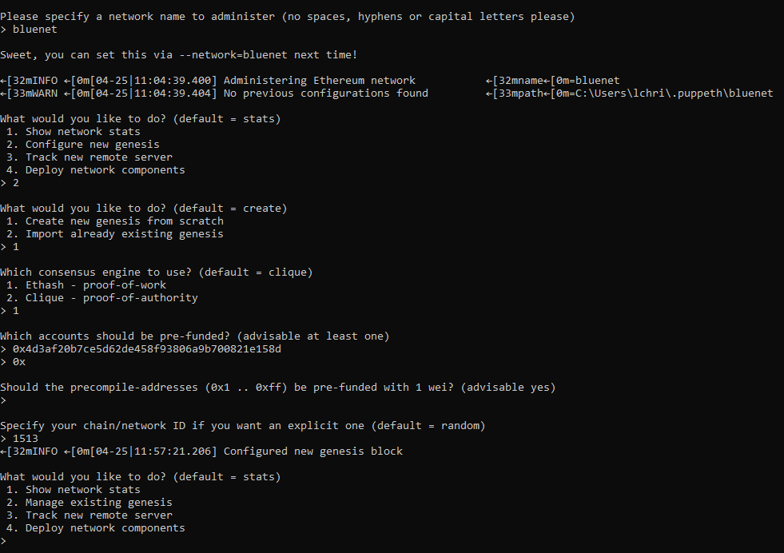

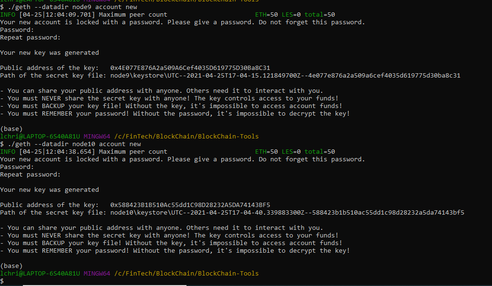

## Install the geth node software

Use the following link to download and install [`geth`](https://geth.ethereum.org/downloads/) to your PC.

## Install MyCrypto wallet

Download and install the GUI version of [MyCrypto wallet](https://download.mycrypto.com/)

With this wallet you'll be able to communicate with custom networks, which will be configure later.

## Run the first node and enable the mining/sealing

`geth --datadir node1 --unlock "0x4E077E876A2a509A6Cef4035D619775D30Ba8C31" --mine --rpc`

Enable the `--rpc` flag on the first node to talk to it later. This defaults to port `8545`.
This will unlock the node's account to enable it to sign blocks.

## Copy the enode address from this node

For example:
`enode://349788dca18445e69b84db13554456cdc1bf4934c383ec3c6da1af6f3a5089761135d657047334803d0c17c8e1164bb9b5bf4df8e07423e02e51282553827979@127.0.0.1:30303 --ipcdisable --allow-insecure-unlock`

## Use the first node's enode address as the bootnode for the second node and run on a separate port

`./geth --datadir node10 --unlock "0x588423B1B510Ac55dd1C98D28232A5DA74143BF5" --mine --port 30304 --bootnodes "enode://349788dca18445e69b84db13554456cdc1bf4934c383ec3c6da1af6f3a5089761135d657047334803d0c17c8e1164bb9b5bf4df8e07423e02e51282553827979@127.0.0.1:30303" --ipcdisable --allow-insecure-unlock`

The first node is used as the bootnode to enable communication between them as well as facilitate the ability to discover new nodes later.

## Success!

You should now be mining/sealing blocks using PoA algorithm. Now let's send a transaction.

## Send a test transaction

Open up MyCrypto and select `Change network` at the bottom left.

Select `Add Custom Node` and use `127.0.0.1:8545` to connect to the first node, add a name, use chain ID `1513` and save.

Your configuration should look similar to the below with the exception of the overwrite message - this screenshot was captured after an attempt to capture a demonstration picture:

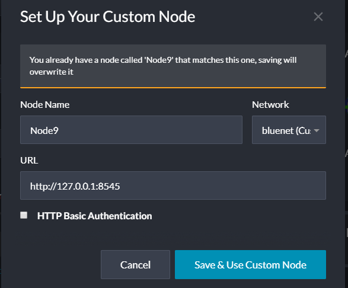

You should now be connected to your private network on the local blockchain.

You should also have a node connected to your private network via MyCrypto

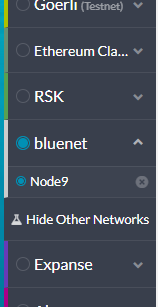

Click on the `Keystore file` option to access the first node's wallet, and navigate to `node9/keystore` and select
the keystore file, then enter `null` as the password.

Prior to sending transactions, the account should have no ether deposited as shown below.

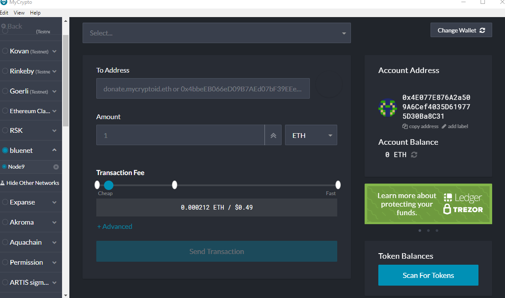

You should now be able to send a transaction. Fill in the second node's account and send it one ETH.

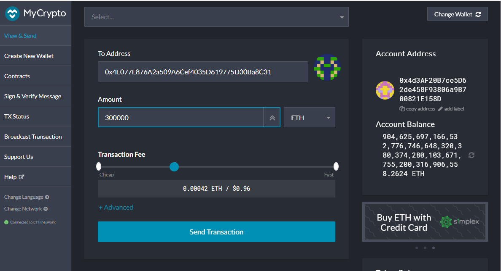

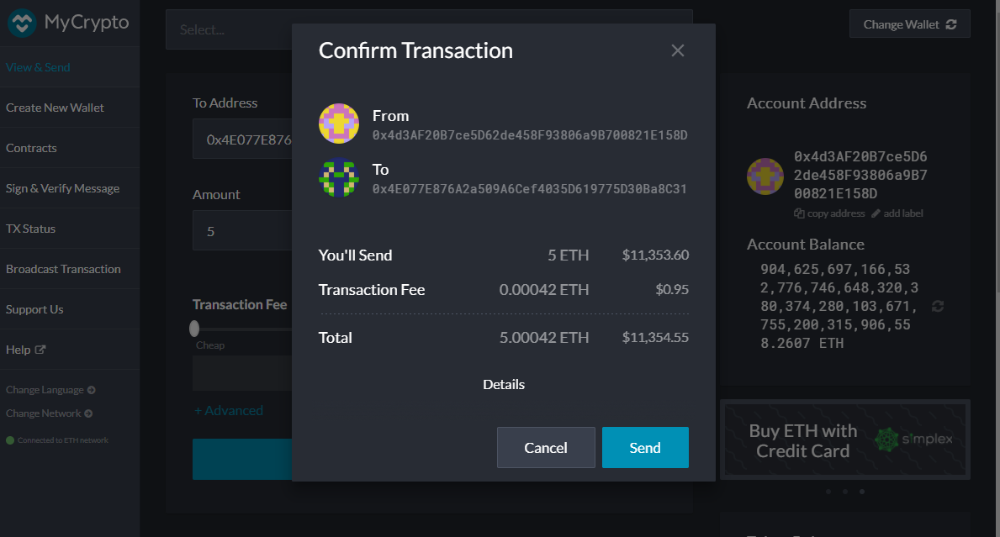

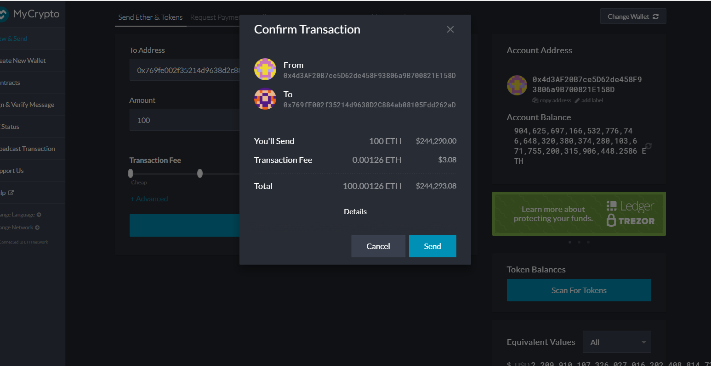

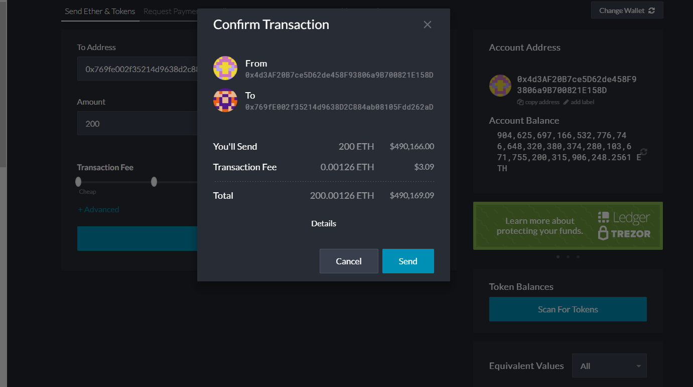

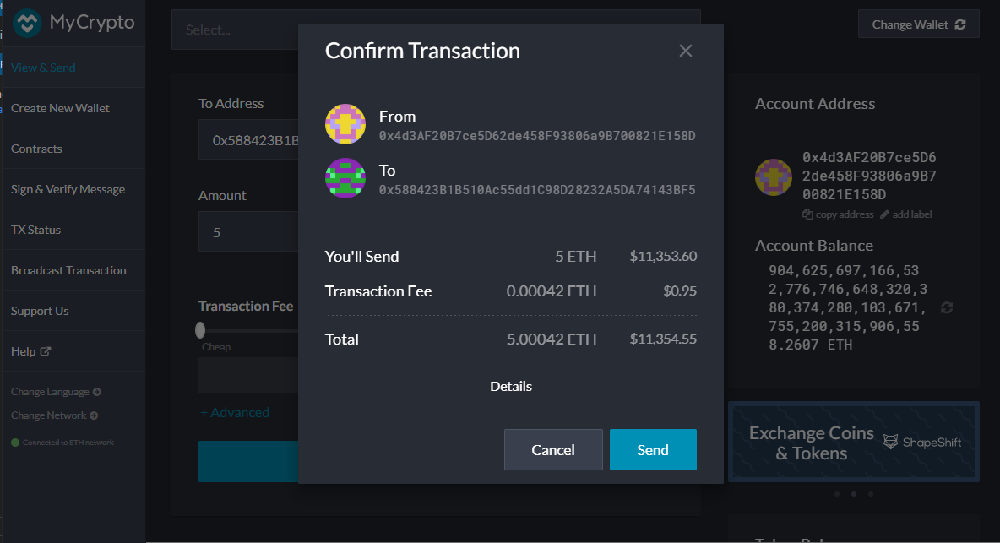

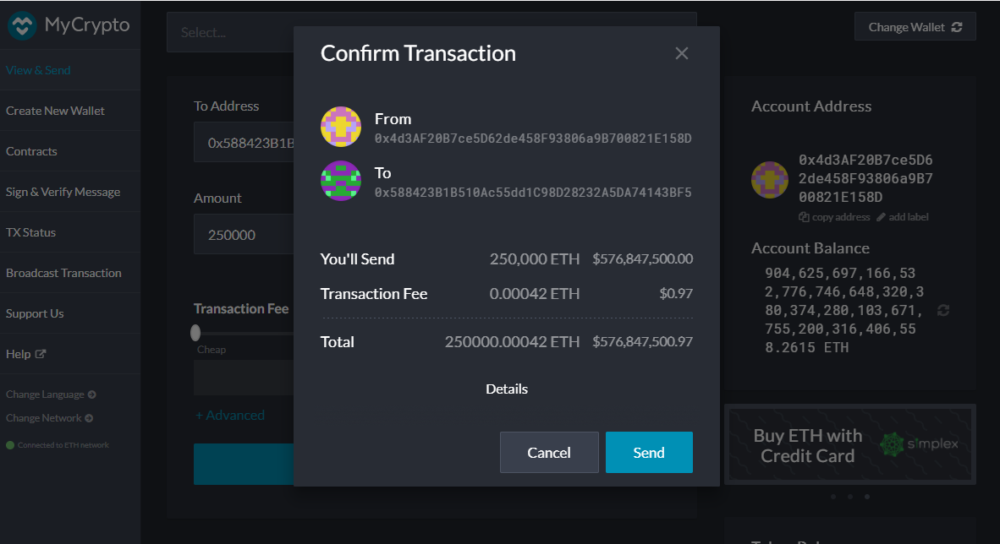

Once confirmed, you can check the TX Status by clicking the button in the popup, or pasting the TX Hash into the TX Status section of the app.

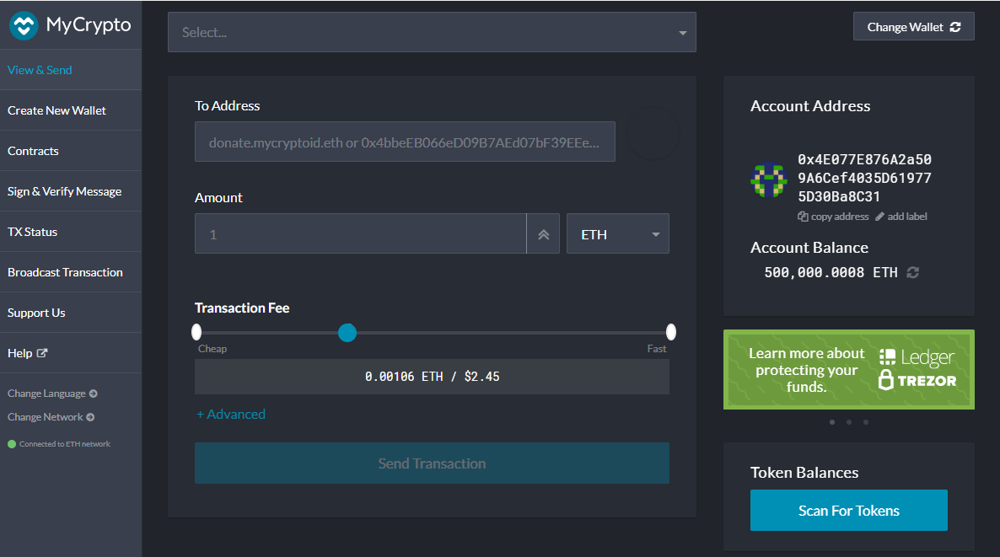

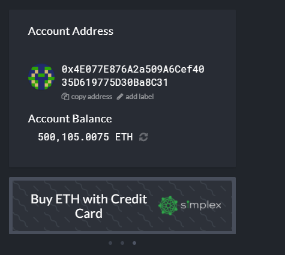

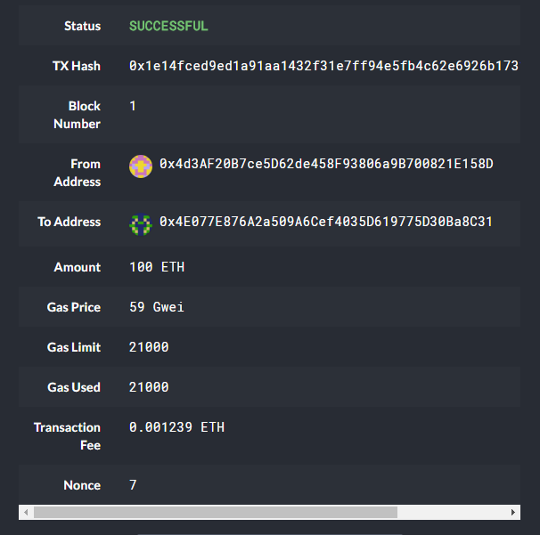

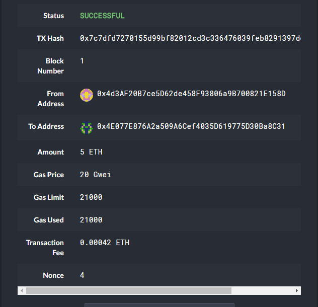

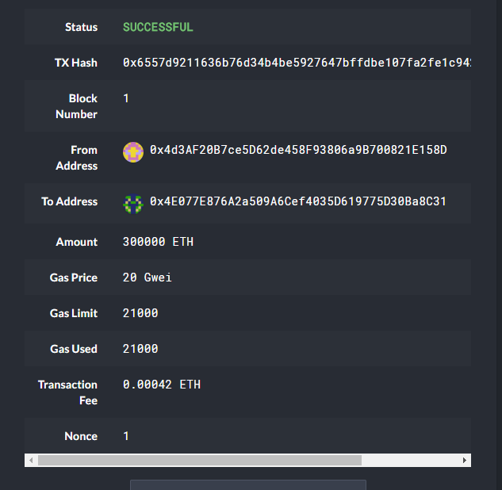

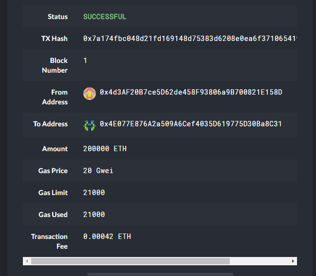

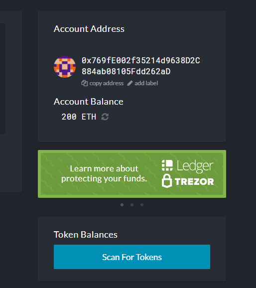

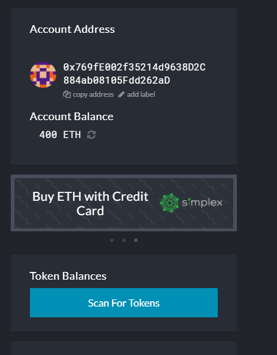

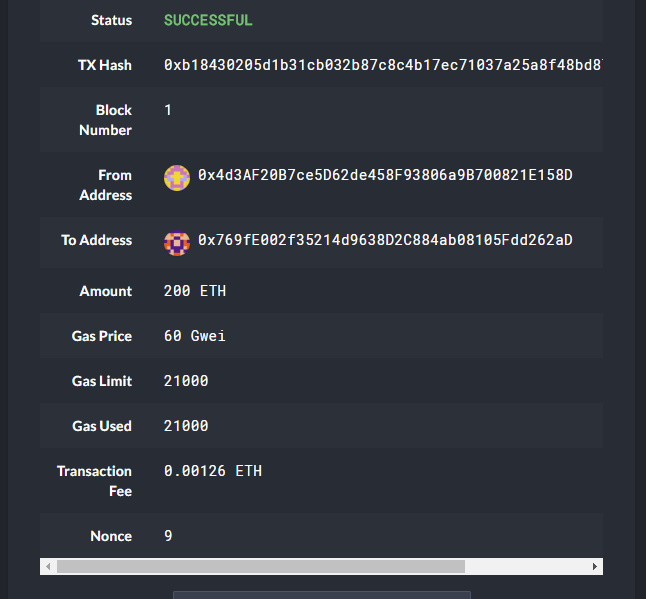

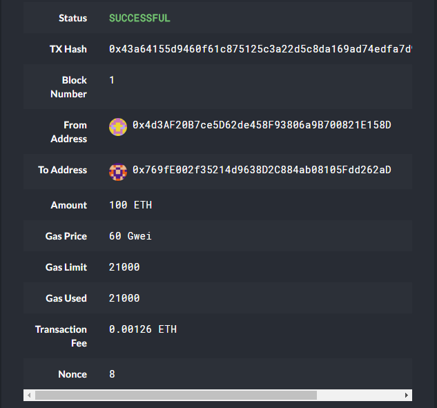

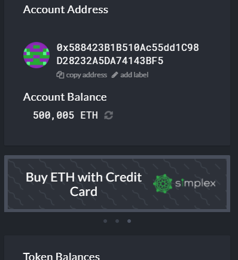

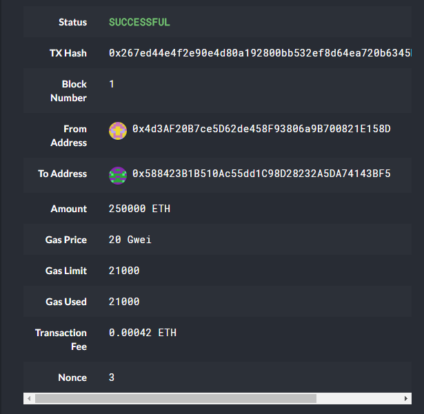

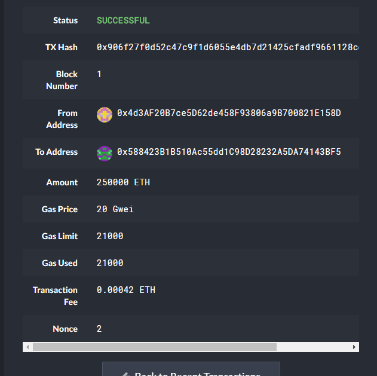

All done! The bluenet blockchain can now be used for local development!
