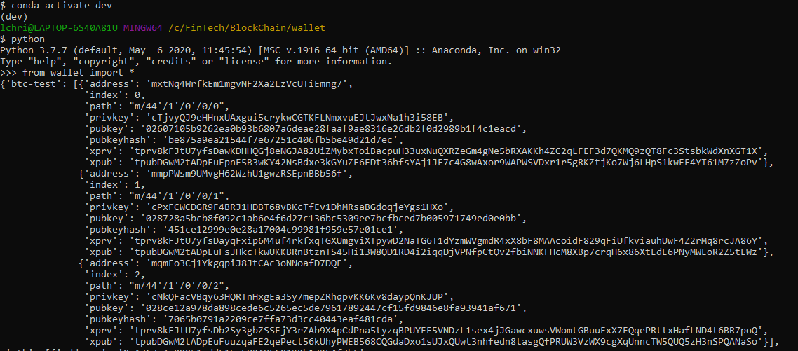
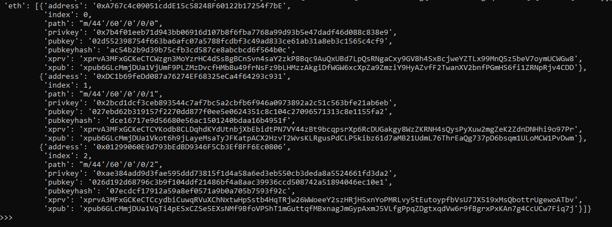
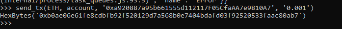
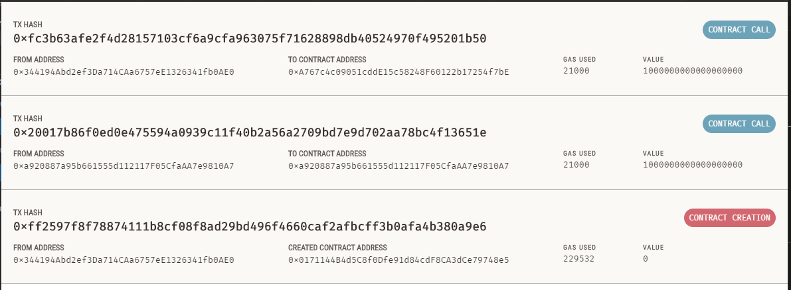
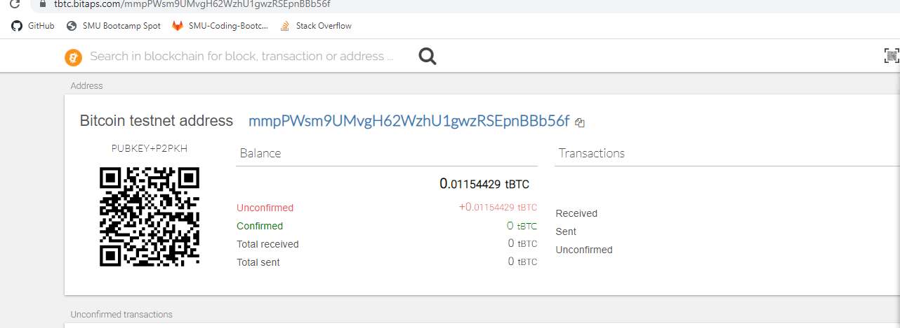
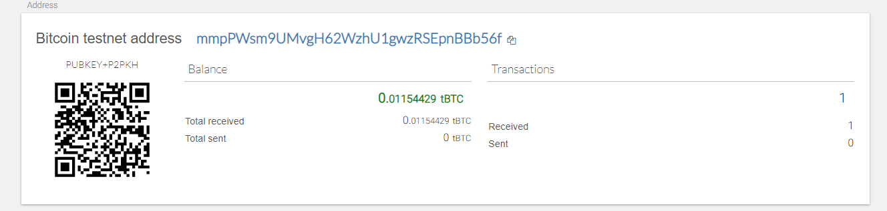

# Python Multi-coin Wallet

This Python wallet supports Ethereum and BTC testnet transactions using the BIP44 standard, and leverages the following libraries:

- [`hd-wallet-derive`](https://github.com/dan-da/hd-wallet-derive) BIP44 Command Line tool supporting 300+ coins

- [`bit`](https://ofek.github.io/bit/) Python Bitcoin library

- [`web3.py`](https://github.com/ethereum/web3.py) Python Ethereum library

## Installation

Install PHP and Python 3.

Install Python dependencies using pip:

`pip install -r requirements.txt`

Then, clone and install `hd-wallet-derive`. Instructions are also available [here](https://github.com/dan-da/hd-wallet-derive#installation-and-running).

```bash
git clone https://github.com/dan-da/hd-wallet-derive
cd hd-wallet-derive
php -r "readfile('https://getcomposer.org/installer');" | php
php composer.phar install
ln -s hd-wallet-derive.php ../derive
cd ..
```

BTCTEST Transaction

open python console

import wallet as seen below

To use the wallet try setting an account as described below:

`account = priv_key_to_account(BTCTEST, coins[BTCTEST][0]['privkey'])`

Now, send a transaction by doing following:

`send_tx(ETH, account, '0xa920887a95b661555d112117F05CfaAA7e9810A7', '0.001')`

The `coins` object contains a list of child wallets for each coin, in this case `BTCTEST` and `ETH`.





Here is an example `ETH` transaction on a local testnet:





Here is an example `BTCTEST` transaction on testnet3:




